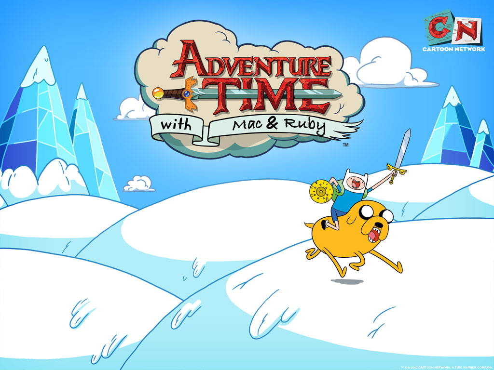

!SLIDE center image

!SLIDE
# MacRuby #
Cocoa so hot it will burn the roof of your mouth

!SLIDE bullets incremental

## MacRuby: The Definitive Guide

http://bit.ly/macruby-book

* Buy this Book

!SLIDE

## What is Cocoa?

!SLIDE bullets incremental

# History

* Brad Cox and Tom Love created it in the early 80s at ITT.

* Backwards Compatibility with C

* Smalltalk like Objects

!SLIDE bullets incremental

# History

* 1980ish ITT
* 1983 PPI (later StepStone)
* 1988 Licensed to NeXT
* 1998 NeXT acquired by Apple
* 2008 MacRuby
* 2011 Proft?

!SLIDE bullets incremental

# What is Objective-C?

* Strict superset of C

* Object syntax from Smalltalk

* Primitives are all from C

* Smalltalk-style messaging

!SLIDE

## Who cares? I only like ruby!

!SLIDE

## Objective-C's language features made MacRuby possible

(dynamic, message based, runtime)

!SLIDE

## If Objective-C is so cool, why not just use it?

!SLIDE

    -[NSBitmapImageRep
      initWithBitmapDataPlanes: planes
                    pixelsWide: width
                    pixelsHigh: height
                 bitsPerSample: bits
               samplesPerPixel: samples
                      hasAlpha: alpha
                      isPlanar: planar
                colorSpaceName: colorspace
                  bitmapFormat: format
                   bytesPerRow: bytes
                  bitsPerPixel: bits];

!SLIDE

## Well, you will have (want) to use it, at some point.

!SLIDE

## But you can make this process way more fun.

!SLIDE

"You want to enjoy life, don't you? If you get your job done quickly and your job is fun, that's good isn't it? That's the purpose of life, partly. Your life is better."

_~Yukihiro Matsumoto_

!SLIDE

# A few basics

!SLIDE

#Run Loop

!SLIDE
# Callbacks / Delegation

!SLIDE
# Events / User Input

!SLIDE

# Xib Files

!SLIDE
# Outlets

!SLIDE

